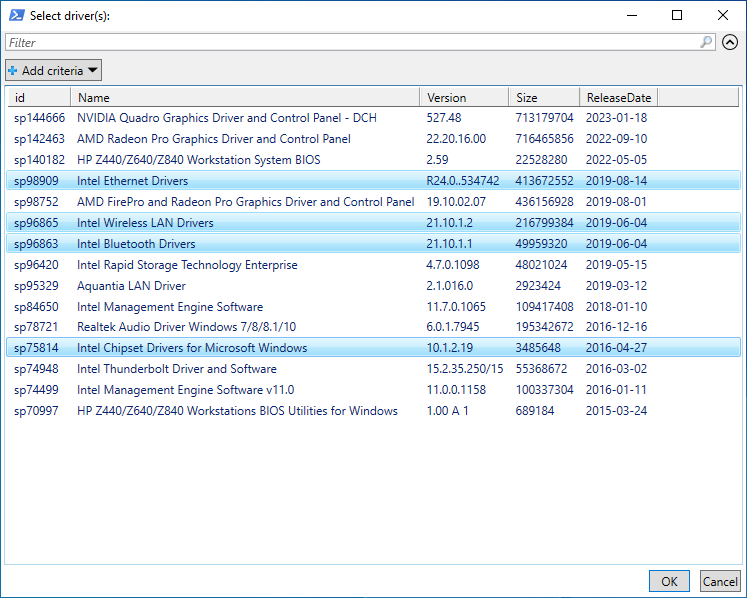
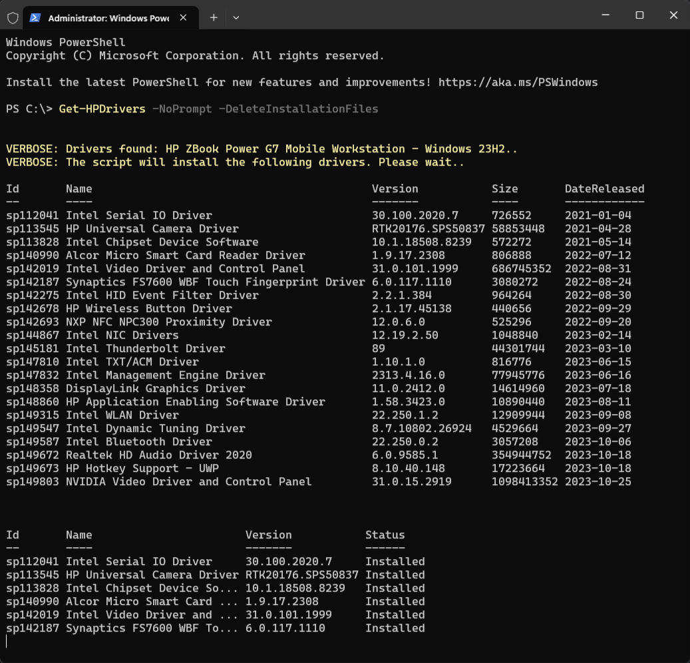

# HPDrivers

Update all HP device drivers with a single command - `Get-HPDrivers`


<hr>

## Installation

Copy the code from the area below and paste it into PowerShell Admin (or Windows Terminal).

```powershell
Set-ExecutionPolicy -ExecutionPolicy RemoteSigned -Force
Install-Module -Name HPDrivers -Force
```

<br>

## How it's working?

The HPDrivers module uses [HP CMSL](https://developers.hp.com/hp-client-management/doc/client-management-script-library) to download and install softpaqs that match the operating system version and hardware configuration.

* Open PowerShell or Windows Terminal as an administrator
* Run `Get-HPDrivers`
* Select the drivers to install

<br>

<p align="center"></p>

<br>

<p align="center"></p>

<br>

## Parameters

`-NoPrompt` [switch] - Install all drivers and update BIOS \
`-ShowSoftware` [switch] - Show additional HP software in the driver list \
`-DeleteInstallationFiles` [switch] - Delete the HP SoftPaq installation files stored in C:\Temp \
`-UninstallHPCMSL` [switch] - Uninstall HP CMSL at the end of installation process \
`-SuspendBL` [switch]  - Suspend BitLocker protection for one restart

<br>

## Examples

Example 1: Simple, just download and install all drivers and BIOS.
```powershell
Get-HPDrivers -NoPrompt
```

<br>

Example 2: Show all available drivers and additional software. Do not keep installation files. Suspend the BitLocker pin on next reboot.
```powershell
Get-HPDrivers -ShowSoftware -DeleteInstallationFiles -SuspendBL
```

<br>

Example 3: Automatic driver installation. Can be part of a deployment script.
```powershell
Install-PackageProvider -Name NuGet -MinimumVersion 2.8.5.201 -Force
Set-ExecutionPolicy -ExecutionPolicy RemoteSigned -Force
Install-Module -Name HPDrivers -Force
Get-HPDrivers -NoPrompt -DeleteInstallationFiles
```