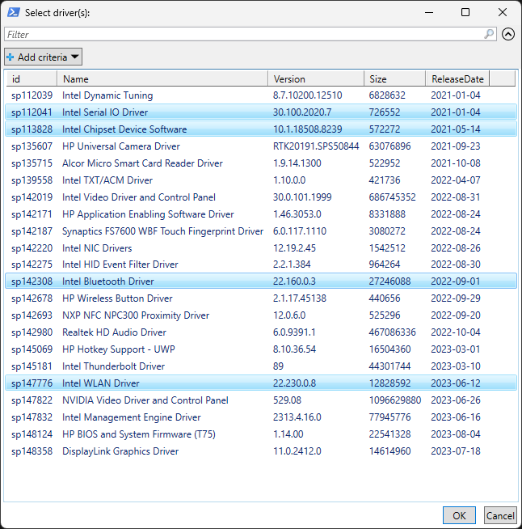

# HPDrivers

Update all HP device drivers with a single command: `Get-HPDrivers`


<hr>

## Installation

Copy the code from the area below and paste it into PowerShell Admin (or Windows Terminal).

```powershell
Set-ExecutionPolicy -ExecutionPolicy RemoteSigned -Force
Install-PackageProvider -Name NuGet -RequiredVersion 2.8.5.201 -Force
Install-Module -Name HPDrivers -Force
```

<br>

## How it's working?

The HPDrivers module downloads and installs HP SoftPaqs that match to the operating system version and hardware configuration.

* Open PowerShell or Windows Terminal as an administrator

* Run `Get-HPDrivers`

* Select the drivers to install

<br>

<p align="center"></p>

<br>

<p align="center"></p>

<br>

## Parameters

`-NoPrompt` [switch] - Download and install all drivers

`-OsVersion` [string] - Specify the operating system version (e.g. 22H2, 23H2)

`-ShowSoftware` [switch] - Show additional HP software in the driver list

`-Overwrite` [switch] - Install the drivers even if the current driver version is the same

`-BIOS` [switch] - Update the BIOS to the latest version

`-DeleteInstallationFiles` [switch] - Delete the HP SoftPaq installation files stored in C:\Temp

`-SuspendBL` [switch]  - Suspend BitLocker protection for one restart

<br>

## Examples

Example 1: Simple, just download and install all drivers.
```powershell
Get-HPDrivers -NoPrompt
```

<br>

Example 2: Show a list of available drivers and additional software. The selected drivers will be installed automatically. Do not keep installation files. Suspend the BitLocker pin on next reboot.
```powershell
Get-HPDrivers -ShowSoftware -DeleteInstallationFiles -SuspendBL
```

<br>

Example 3: Download and install all drivers and BIOS, even if the current driver version is the same.
```powershell
Get-HPDrivers -NoPrompt -BIOS -Overwrite
```

<br>

Example 4: Show a list of available drivers that match the current platform and Windows 22H2. The selected drivers will be installed automatically.
```powershell
Get-HPDrivers -OsVersion '22H2'
```

<br>

Example 5: Automatic driver installation. Can be part of a deployment script.
```powershell
Set-ExecutionPolicy -ExecutionPolicy RemoteSigned -Force
Install-PackageProvider -Name NuGet -RequiredVersion 2.8.5.201 -Force
Install-Module -Name HPDrivers -Force
Get-HPDrivers -NoPrompt -BIOS -DeleteInstallationFiles
```